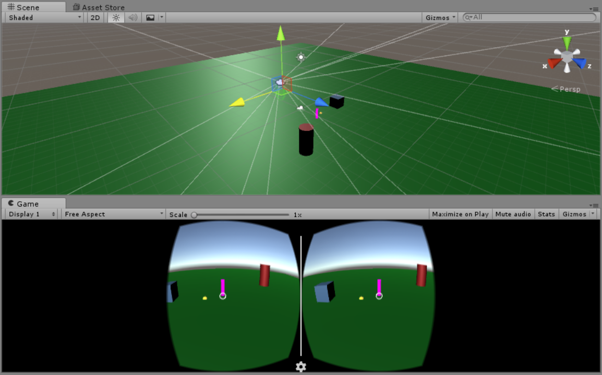

# locomotion-vr-tests
Unity scene using GoogleVR, testing some player locomotion ideas with limited user input.

See a video of this in action here: https://youtu.be/ou8TKis23rc

Based on an idea I blogged about here: http://blog.hiash.com/2016/08/vr-teleportation-mechanic_1.html

The player is able to look around the scene by moving their head. By gazing at a spot on the floor and tapping, a View Marker will be placed. By gazing at some other point and tapping, the player will teleport, (actually, just move quickly,) to that second spot. When they reach it, the player's (virtual) body will turn to face the View Marker they first placed. Note that the head rotates independently from the body so your eyes may not be facing the view marker directly unless your head is facing forwards. The player can then repeat this by placing the View Marker again.

Alternatives could be made to this, such as persisting the View Marker until the player wants to reposition it, (easier if we had more buttons, but could be done with a long tap or by tapping directly on the View Marker to pick it up.)
